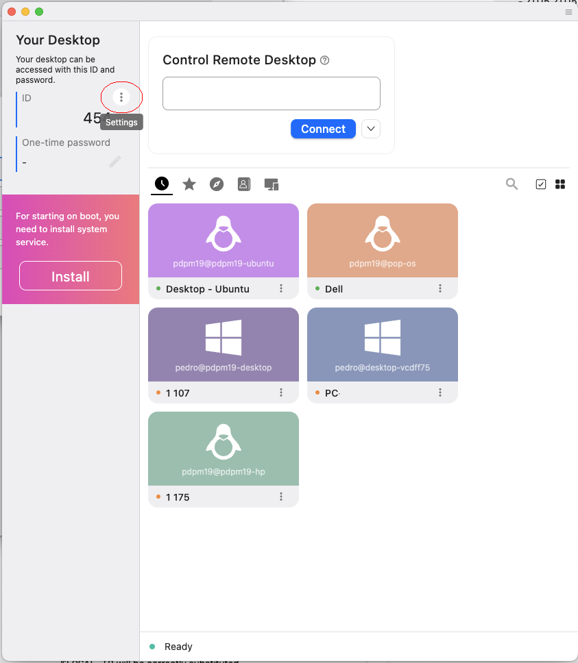

# Client
## 1. Download the Client App
Choose and install the desirable client https://github.com/rustdesk/rustdesk/releases

After that you should see an app like this 

## 2. Configure the App
Now we should configure the Security and Network. For that we should select the three dots icon, near your ID

After that we should configurate the Network - ID/Relay Server and add the ID Server, Relay Server and public key.

