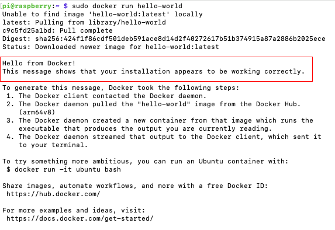
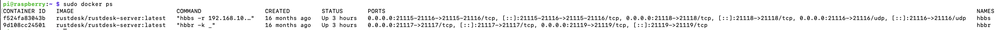

# Server (Linux Distro)

## 1. Install Docker
We're going to install docker using the APT repository
```bash
# Add Docker's official GPG key:
sudo apt-get update && sudo apt-get upgrade -y
sudo apt-get install ca-certificates curl
sudo install -m 0755 -d /etc/apt/keyrings
sudo curl -fsSL https://download.docker.com/linux/raspbian/gpg -o /etc/apt/keyrings/docker.asc
sudo chmod a+r /etc/apt/keyrings/docker.asc

# Add the repository to Apt sources:
echo \
  "deb [arch=$(dpkg --print-architecture) signed-by=/etc/apt/keyrings/docker.asc] https://download.docker.com/linux/raspbian \
  $(. /etc/os-release && echo "$VERSION_CODENAME") stable" | \
  sudo tee /etc/apt/sources.list.d/docker.list > /dev/null
sudo apt-get update

# Install docker packages
sudo apt-get install docker-ce docker-ce-cli containerd.io docker-buildx-plugin docker-compose-plugin

# hello-world example
sudo docker run hello-world
```

If all commands run correctly you should see something similar to this.



Now we can move to the next step.

## 2. Download and Configuration of the Server app
RustDesk needs two executables:
- hbbs - RustDesk ID server (signaling)
    - TPC ports: 21115, 21116, 21118
    - UDP: 21116
- hbbr - RustDesk relay server
    - TPC: 21117, 21119

If needed, the previous ports will need to be open in the firewall
```bash
# Install the firewall
sudo apt-get install ufw

LOCAL_IP="192.168.x.x"
# Adds acess via SSH
ufw allow proto tcp from $LOCAL_IP to any port 22

# Adds the ports
ufw allow 21114:21119/tcp
ufw allow 8000/tcp
ufw allow 21116/udp
sudo ufw enable
```

Now we can download the executables
```bash
# First we create the home directory for rustdesk
mkdir -p $HOME/rustdesk/hbbs
mkdir -p $HOME/rustdesk/hbbr
cd $HOME/rustdesk

# Then we create the docker compose file (change the LOCAL_IP variable to your current network IP 192.168.x.x, before running this script)
LOCAL_IP="192.168.x.x"
cat <<EOF > docker-compose.yml
networks:
  rustdesk-net:
    external: false

services:
  hbbs:
    container_name: hbbs
    ports:
      - 21115:21115
      - 21116:21116
      - 21116:21116/udp
      - 21118:21118
    image: rustdesk/rustdesk-server:latest
    command: hbbs -r $LOCAL_IP:21117 -k _
    volumes:
      - ./hbbs:/root
    networks:
      - rustdesk-net
    depends_on:
      - hbbr
    restart: unless-stopped

  hbbr:
    container_name: hbbr
    ports:
      - 21117:21117
      - 21119:21119
    image: rustdesk/rustdesk-server:latest
    command: hbbr -k _
    volumes:
      - ./hbbr:/root
    networks:
      - rustdesk-net
    restart: unless-stopped
EOF

# Start the containers
sudo docker compose up -d

# Verify
ls $HOME/rustdesk
sudo docker ps
```

And it's all for ther server side
